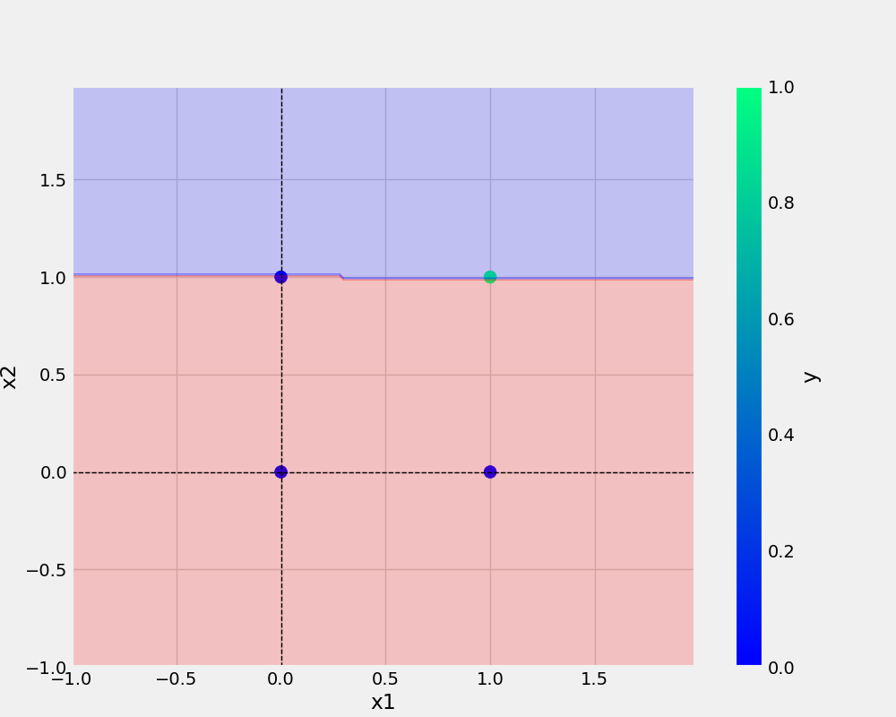

# OneNueron
OneNueron|Perceptron

#command used -

'''bash
git add . && git commit -m "docstring updated" && git push origin main
''''

'''bash
cp Research\ noteook/demo.ipynb .
'''bash

## Add URL-
[Git handbook](https://guides.github.com/introduction/git-handbook/)

<a href="https://www.w3schools.com">Visit W3Schools.com!</a>>

## Add Images-

